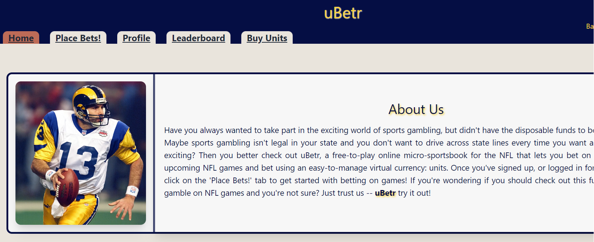
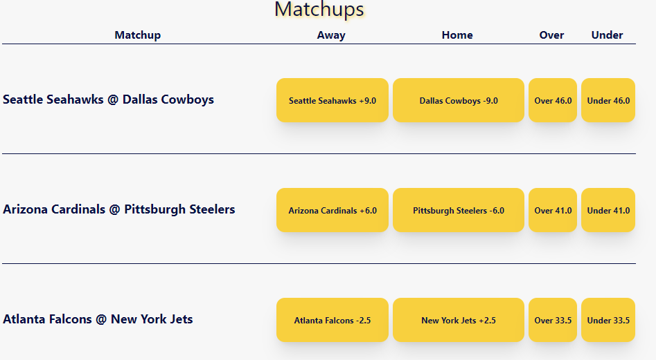
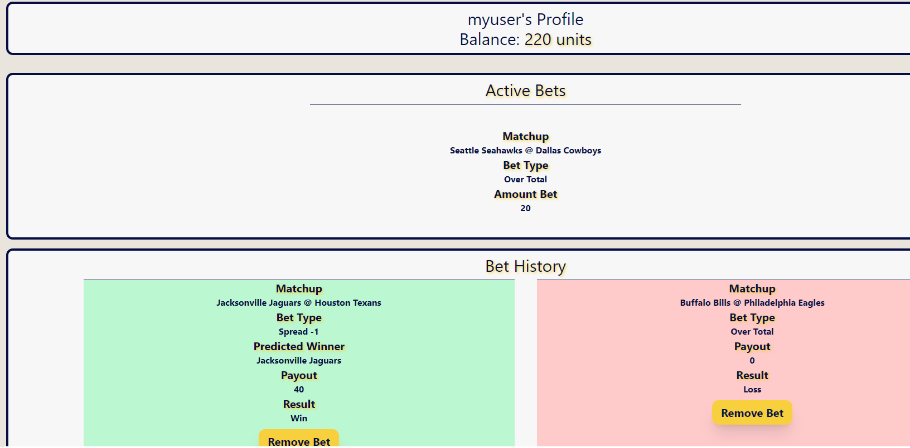

# uBetr-- NFL MicroSportsbook
    

    
## Description
Since the legalization of sports gambling, the discourse around betting on sports has grown at an alarming rate. If you turn on any sports station on TV or the radio, you will hear people discussing point spreads, overs, unders, and payouts. uBetr addresses the problem of bringing all the fun of sports gambling with almost none of the stakes. It allows users in non-legal states a fun alternative to sports gambling, it provides a stakes-free medium for those interested in sports but unwilling to spend real money.

This project initially started as a medium for comparing betting odds of various online sportsbooks, but this data is heavily protected from scrapes and sportsbooks don't publish their APIs for fear of competition. We decided once we were able to access a single sportsbook's odds that we should attempt to create our own online sportsbook experience. With the wealth of data available (almost too much) we limited our pursuits to gambling on the NFL. If we had more time and resources, expanding to basketball and other sports was definitely an option for us.
    
## Table of Contents
- [Installation](#installation)
- [Usage](#usage)
- [License](#license)
- [Contributing](#contributing)
- [Tests](#tests)
- [Questions](#questions)
- [Links](#links)
- [Screenshots](#screenshots)

## Installation
The project is an online web application and does not require installation. Users can simply access the site and either sign up or log in to start the fun

## Usage
Once the user logs in or signs up, head to "Place Bets!" and look through the various betting options. Our application will allow you to bet any game Las Vegas currently has odds for, and the odds update live! Users can wager any number of "units" our virtual online currency. We have the infrastructure in place to add the option for a microtransaction to allow users to buy more units, but the stripe capability became too overwhelming late in production.

## License
https://choosealicense.com/licenses/MIT/

MIT License

Copyright (c) 2023

Permission is hereby granted, free of charge, to any person obtaining a copy
of this software and associated documentation files (the "Software"), to deal
in the Software without restriction, including without limitation the rights
to use, copy, modify, merge, publish, distribute, sublicense, and/or sell
copies of the Software, and to permit persons to whom the Software is
furnished to do so, subject to the following conditions:

The above copyright notice and this permission notice shall be included in all
copies or substantial portions of the Software.

THE SOFTWARE IS PROVIDED "AS IS", WITHOUT WARRANTY OF ANY KIND, EXPRESS OR
IMPLIED, INCLUDING BUT NOT LIMITED TO THE WARRANTIES OF MERCHANTABILITY,
FITNESS FOR A PARTICULAR PURPOSE AND NONINFRINGEMENT. IN NO EVENT SHALL THE
AUTHORS OR COPYRIGHT HOLDERS BE LIABLE FOR ANY CLAIM, DAMAGES OR OTHER
LIABILITY, WHETHER IN AN ACTION OF CONTRACT, TORT OR OTHERWISE, ARISING FROM,
OUT OF OR IN CONNECTION WITH THE SOFTWARE OR THE USE OR OTHER DEALINGS IN THE
SOFTWARE.
    
## Contributing
Other developers who collaborated with me on this project: Team 1, our development team, was made up of Kevin Donnelly, Nate Master, and Jack Stendeback.

Outside assets I used on this project: For betting odds, we utilized the point spreads and point totals of Bovada Online Casino. To use game results to validate user's bets, we utilized the API from ESPN.
    
## Tests
To test the validator, cd to the server side and run 'npm run test'. That will fire up the jest suite to test the validation algorithm (Note, the tests are written to test games from Week 12 of the NFL season. Any tests for future weeks would have to be rewritten to account for different game results.)
    
## Questions
Do you still have questions or further inquiries? Reach out to us on GitHub at http://github.com/natejmaster, http://github.com/KDonnelly33, or http://github.com/JackStendeback

## Links

[Heroku Deployment](https://rocky-hollows-26852-54ebc26e9935.herokuapp.com/)
[GitHub Repository](https://github.com/natejmaster/sports-gambling-odds-comp)

## Screenshots
Our Home page and introduction

A list of possible bets on our 'Place Bets' tab

A user's profile with both their active bets and color-coded bet history.
